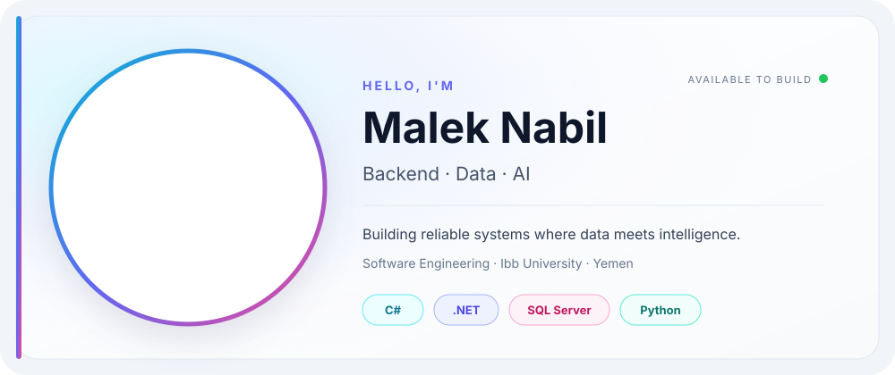

<!--
  MALEK.OS — GitHub Profile README
  1) Replace every YOUR_GITHUB_USERNAME with the GitHub account name.
  2) Replace the LinkedIn and email placeholders near the bottom.
  3) Keep .github/workflows/snake.yml to generate the contribution snake.
-->

<code>MALEK.OS / README.md</code>

  

 

  

<code>GITHUB.PULSE // LIVE METRICS</code>

  

<table>
  <tr>
    <td width="50%">
      
    </td>
    <td width="50%">
      
    </td>
  </tr>
</table>

 

 

<code>CONTRIBUTION.TRACE // AUTONOMOUS SNAKE</code>

  

<picture>
  <source media="(prefers-color-scheme: dark)" srcset="https://raw.githubusercontent.com/Malek711/Malek711/output/github-contribution-grid-snake-dark.svg" />
  <source media="(prefers-color-scheme: light)" srcset="https://raw.githubusercontent.com/Malek711/Malek711/output/github-contribution-grid-snake.svg" />
  
</picture>

 

<code>TRACE REFRESH: EVERY 24 HOURS</code>

  

<code>MALEK.OS // BUILD · LEARN · SHIP</code>

