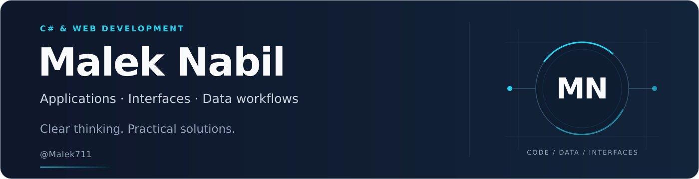

## About

I build practical applications and technical learning tools, with an interest in clear interfaces and dependable data workflows. My work spans C# data access and web development.

## Selected Projects

- **[Contact Manager](https://github.com/Malek711/Contact-Manager-ADO.NET)** — A console tool for finding, updating, and deleting contact records through parameterized database queries. **Tech:** C#, ADO.NET, SQL Server.
- **[C++ Graphics Functions Tutorial](https://github.com/Malek711/CPP-Graphics-Functions-Tutorial)** — An Arabic reference that makes `graphics.h` functions easier to find and use in computer graphics labs. Its navigable, print-friendly page uses HTML, CSS, JavaScript, and Prism.js.

## Technical Skills

- **Application and data work:** C#, ADO.NET, SQL Server.
- **Web interfaces:** HTML, CSS, JavaScript, React, TypeScript, Vite.
- **Learning resources:** C++ graphics (`graphics.h`) examples.
- **Currently learning:** PostgreSQL-backed APIs and Vercel Functions.

## Current Focus

I am building **Madar**, an Arabic exam-practice platform, and moving its challenge API to Vercel Functions and PostgreSQL.

## Connect

[GitHub](https://github.com/Malek711) · [Email](mailto:alkosimalek@gmail.com)
